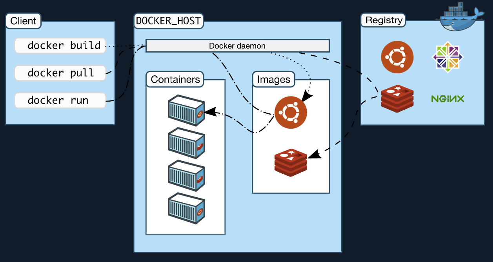

# docker-practice          


## Docker Architecture    
   

### docker daemon    
* Docker API 요청을 수신하고, Docker Object(image, container, network, volume)를 관리한다.        
* Docker 서비스를 관리하기 위해 다른 docker daemon 과도 통신할 수 있다.

### docker client     
* docker와 interaction을 위해 가장 많이 사용하는 방법이다.    
* docker API를 사용하여 docker daemon에 요청을 보낸다.    
* 다수의 daemon과 통신할 수 있다.     

### docker registry    
* image를 저장하는 registry이다.    
* 그중 docker hub는 public registry 이며, docker는 default로 docker hub를 바라보도록 설정되어 있다.    


### docker object
docker object에는 image, container, network, volume 등이 있다.
#### image
* __container__ 를 만들기위한 __read-only template__ 이다.    
* 보통 image는 __다른 image__ 를 기반으로 __additional customizing__ 을 통해 만들어진다.   
* __Dockerfile__ 을 통해 image를 정의하는 step을 서술하여 __docker image__ 를 만들 수 있다.    
  * 이때 각 step은 image의 __layer__ 가 된다.    
  * Dockfile을 수정하여 다시 image를 빌드하면 __변경된 layer만 rebuild__ 된다.
  * 이 부분이 image가 다른 가상화 기술에 비해 __lightweight, small, fast__ 할 수 있는 요인이다.    


#### container     
* image의 __runnable instance__ 이다.
* docker API 나, CLI를 통해 생성, 실행, 삭제, 이동을 할 수 있다.
  > 💡 API를 활용하면 애플리케이션의 런타임에서 container handling이 가능할 것 같다.     
* 다른 docker object와 상호작용을 할수 있다.   
  * 여러개의 __network__ 와 연결할 수 있다.    
  * __storage__ 를 붙일 수 있다.   
  * 현재 상태를 __image__ 로 만들 수 있다.    
* 다른 container 또는 host machine과의 isolation 을 설정할 수 있다.
  * network
  * storage
* image 뿐만 아니라 create, start 하는 시점에 다양한 설정을 제공할 수 있다.
  * 단, container가 삭제되면, persistent storage에 저장되지 않은 모든 상태 정보는 사라진다.      


#### example ```docker run```  command         

```
$ docker run -i -t ubuntu /bin/bash
```      

```ubuntu``` 컨테이너를 실행하고, 나의 local CLI session을 interactively 붙인다. 그리고 ```/bin/bash``` 를 실행한다.            

flow      
1. ```ubuntu``` image가 local에 없다면, configured registry (default: docker hub) 에서 image를 찾아 pull한다. 
   > ```$ docker pull ubuntu```     
2. 새로운 container를 생성한다.     
   > ```$ docker container create```     
3. read-write filesystem을 container의 final-layer에 할당한다. 이를 통해 실행 중인 container가 local filesystem에 파일 생성과 수정이 가능하다.   
4. 별도의 networking option을 주지 않았다면 network interface를 생성하여 container가 default network에 연결할 수 있도록 하며, container에 ip 주소를 할당한다. 기본적으로 container는 host machine의 network를 통해 external network에 연결할 수 있다.     
   > 💡 network interface는 host machine에 생성된다는 의미일까?      
   > 💡 ip address는 어떻게 할당되며, 어떻게 확인할 수 있을까?            
5. container를 시작하고, ```/bin/bash``` 를 실행한다. ```-i```, ```-t``` 옵션을 주었기 때문에 나의 keyboard로 input을 줄 수 있고, 나의 terminal에 output을 logging 할 수 있다.      
   > 💡 i 옵션은 무엇일까?            
   > 💡 t 옵션은 무엇일까?            


### underlying techs
* __Go__ 로 작성되었다. 
* linux kernel의 여러 feature를 활용하여 기능 제공한다.      
* container와 같은 isolated workspace를 제공하기 위해 namespace를 활용한다.        


